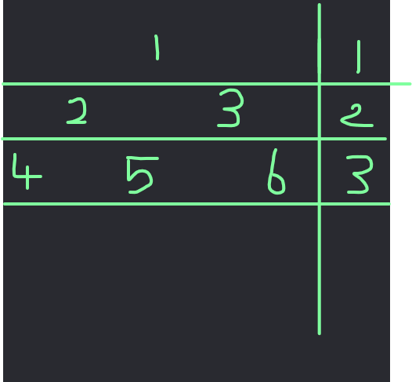

There is a relation between children, parent by  depth. 
      if we start root node with index=1 and depth=0. 
      left-child would be : parent+depth. 
      right-child : parent+depth+1 . 
===
 
2= 1+1 
3= 1+1+1 
4=2+2 
5=2+2+1 or 3+2 
6=3+2 
===
